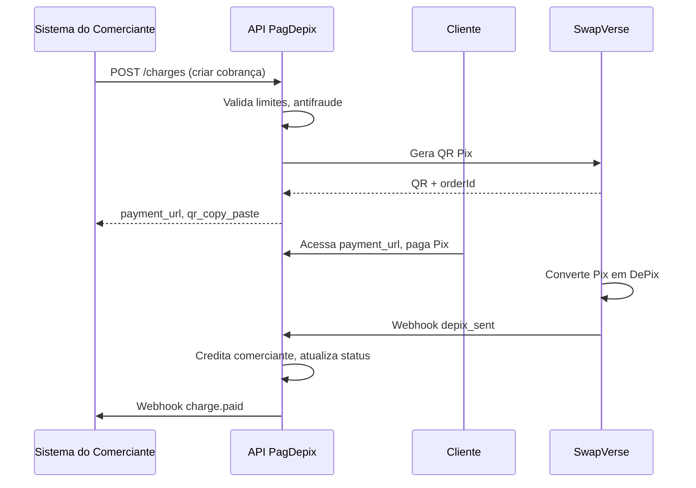

# PagDepix Commerce – API Gateway para Comerciantes

Especificação técnica da API de pagamentos para integração de comerciantes. Permite criar cobranças, consultar status, receber webhooks e obter relatórios.

---

## Visão geral

- **Base URL**: `https://api.pagdepix.com/api` (produção) ou `https://api.pagdepix.com/api/sandbox` (testes)
- **Autenticação**: Bearer token (API Key do comerciante) ou `X-API-Key` + `X-API-Secret`
- **Formato**: JSON

---

## Autenticação

### Modelo proposto

```http
Authorization: Bearer <commerce_api_key>
```

ou

```http
X-API-Key: <api_key>
X-API-Secret: <api_secret>
```

A API Key é gerada no painel do comerciante após aprovação do Modo Comércio. Cada comerciante pode ter múltiplas chaves (produção/sandbox, por ambiente).

---

## Endpoints principais

### 1. Criar cobrança (link de pagamento)

**POST** `/commerce/api/charges`

Cria uma nova cobrança e retorna URL/link de pagamento e dados do QR Code Pix.

**Request:**
```json
{
  "amount": 99.90,
  "description": "Pedido #1234",
  "metadata": {
    "order_id": "1234",
    "customer_email": "cliente@email.com"
  },
  "expires_in_minutes": 30
}
```

**Response:**
```json
{
  "id": "ch_abc123",
  "status": "pending",
  "amount": 99.90,
  "payment_url": "https://pagdepix.com/pay/abc123",
  "qr_code_url": "https://...",
  "qr_copy_paste": "00020126...",
  "expires_at": "2025-03-01T12:30:00Z",
  "created_at": "2025-03-01T12:00:00Z"
}
```

---

### 2. Consultar status da cobrança

**GET** `/commerce/api/charges/:chargeId`

Retorna o status atual da cobrança.

**Response:**
```json
{
  "id": "ch_abc123",
  "status": "paid",
  "amount": 99.90,
  "paid_at": "2025-03-01T12:15:00Z",
  "tx_hash": "liquid_tx_hash_here",
  "metadata": {}
}
```

**Status possíveis:** `pending` | `paid` | `expired` | `cancelled` | `refunded`

---

### 3. Gerar link de pagamento (valor fixo)

**POST** `/commerce/api/links`

Cria um link de pagamento com valor fixo.

**Request:**
```json
{
  "amount": 50.00,
  "title": "Consulta médica",
  "slug": "consulta-50"
}
```

**Response:**
```json
{
  "id": "link_xyz",
  "url": "https://pagdepix.com/pay/consulta-50",
  "amount": 50.00,
  "slug": "consulta-50",
  "created_at": "2025-03-01T12:00:00Z"
}
```

---

### 4. Webhooks

O comerciante configura uma URL de webhook no painel. O PagDepix envia eventos via POST:

**Headers:**
```http
X-PagDepix-Signature: sha256=<hmac_signature>
X-PagDepix-Event: charge.paid
X-PagDepix-Timestamp: 1709294400
```

**Payload (exemplo `charge.paid`):**
```json
{
  "event": "charge.paid",
  "data": {
    "id": "ch_abc123",
    "amount": 99.90,
    "status": "paid",
    "paid_at": "2025-03-01T12:15:00Z",
    "tx_hash": "...",
    "metadata": {}
  }
}
```

**Eventos:** `charge.created` | `charge.paid` | `charge.expired` | `charge.cancelled`

---

### 5. Relatórios

**GET** `/commerce/api/reports/transactions`

**Query params:** `start_date`, `end_date`, `status`, `page`, `limit`

**Response:**
```json
{
  "transactions": [
    {
      "id": "ch_abc123",
      "amount": 99.90,
      "status": "paid",
      "created_at": "...",
      "paid_at": "..."
    }
  ],
  "pagination": {
    "page": 1,
    "limit": 20,
    "total": 150
  }
}
```

---

### 6. Configurar taxas (admin/comerciante custom)

**PUT** `/commerce/api/settings/fees`

Permite ajustar taxas para planos enterprise (sob aprovação).

---

### 7. Validar transação na Liquid

**GET** `/commerce/api/transactions/:id/verify`

Retorna dados da transação na blockchain Liquid para auditoria.

---

## Fluxo de pagamento



---

## Modelo de monetização

| Item | Valor |
|------|-------|
| Taxa por transação | 0,5% + R$ 0,99 |
| Mensalidade | R$ 0 (gratuita) |
| Depósito inicial | R$ 5,00 (convertido em colateral) |
| API | Inclusa no Modo Comércio |

**Planos futuros (sugestão):**
- **Starter**: Padrão (0,5% + R$ 0,99)
- **Pro**: Volume &gt; R$ 50k/mês → 0,4% + R$ 0,79
- **Enterprise**: Contrato custom, taxas negociadas, suporte prioritário

---

## Segurança

- TLS 1.3 obrigatório
- Validação de assinatura em webhooks (HMAC-SHA256)
- Rate limiting por API Key
- IP whitelist opcional
- Logs de auditoria

---

## Próximos passos de implementação

1. Criar modelo `CommerceApiKey` no Prisma (ou estender `ApiKey` para commerce)
2. Implementar endpoints em `backend/src/routes/commerceApiRoutes.ts`
3. Middleware de autenticação `commerceApiKeyAuth`
4. Serviço de webhooks para comerciantes
5. Documentação OpenAPI/Swagger
6. Painel no frontend para gerar chaves e configurar webhooks
